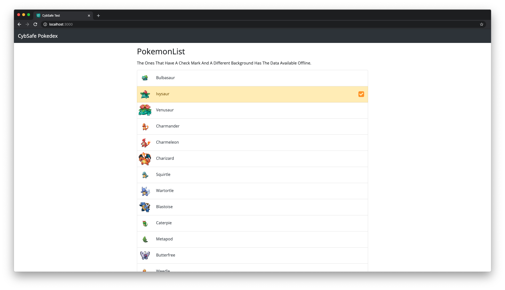
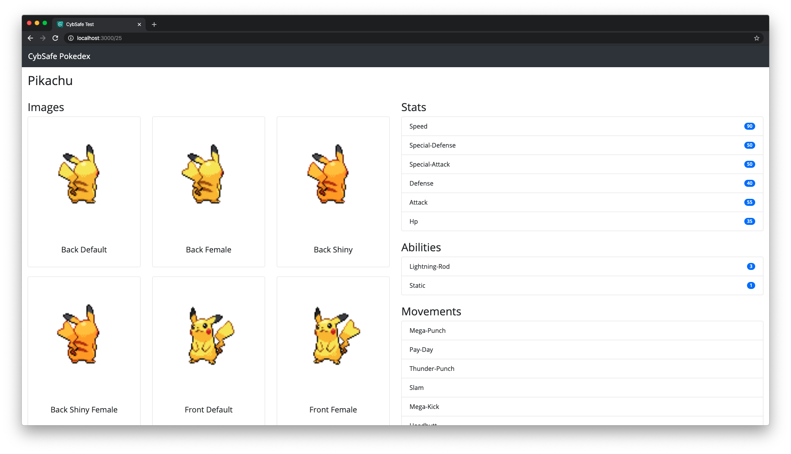

# At CybSafe we love Pokemons! 

First of all, welcome! This test will be your way to prove yourself that you are worthy to grab the hammer of Thor!
> Jokes aside, this our technical test :)

## Solution

### Features

* Caches the data for already visited pokemons so no extra AJAX calls.
* Shows already visited and offline available pokemons with a checkmark.
* Uses less HTTP requests and React router.

### Screenshots

The main home page.

The pokedex entry page.

## Original Challenge

### Your Challenge

* You will need to create a [pokedex](https://pokemon.fandom.com/wiki/Pok%C3%A9dex) with the help of an api that we will provide.
* We know that already exists a lot of versions of it but, we want you to create a version of your own and make it with a personal touch. 
* We are interested in your creativity and the way you write code
* It doesn't have to be perfect, that's why we will not put so much attention on how it looks but it has to work properly. 

#### Requirements

* Use this api [https://pokeapi.co/](https://pokeapi.co/) to get the data for what you need.
* Create a React application that uses the api above and will have this features:

Application Requirements:

1. A list page of all pokemon
2. A pokemon detail page, showing a user all the pokemon goodness:
   1. Image of the pokemon
   1. A description 
   1. Choose some of it's characteristics like: Stats, Abilities, Movements etc ... maximum 5
3. An option to search from the list page, where we can search for different pokemons and show the result

* You can use whatever UI library you prefere if it will be easy to build the app
* Demonstrate or consider your approach to testing / TDD.
* The code can be send like a git repository or a [codesandbox](https://codesandbox.io) link
* Spend no more than 2 hours on this, we love pokemon but we want you to have a life, and it gives us plenty to talk about face to face.

#### Good luck !